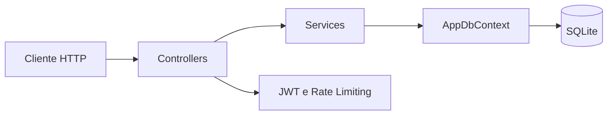

# TaskManagerAPI

TaskManagerAPI é uma API REST para gerenciamento de tarefas, desenvolvida como projeto de estudo com foco em um backend completo e próximo de um cenário real. O projeto cobre autenticação, autorização por proprietário, persistência, segurança, testes de integração e automação de build.

A ideia foi simular um fluxo que acontece no dia a dia: cadastro e login, geração de token, rotas protegidas, regras de validação e evolução do banco com migrations.

## Funcionalidades

- Cadastro e login de usuarios com access token JWT e refresh token
- Rotacao de refresh tokens, deteccao de reuso e logout com revogacao da sessao
- Rotas de tarefas protegidas com autorizacao
- Isolamento das tarefas por usuario autenticado
- CRUD completo de tarefas
- Validacoes com DataAnnotations
- Filtros por status e busca por titulo
- Paginacao e ordenacao das tarefas
- Rate limiting nos endpoints de autenticacao
- Health checks de processo e banco de dados
- Logging estruturado sem dados sensiveis
- Testes automatizados de integracao com xUnit
- Execucao em Docker com persistencia do SQLite
- CI com GitHub Actions
- Documentacao interativa via Swagger

## Tecnologias

- C#
- .NET 10 (ASP.NET Core Web API)
- Entity Framework Core
- SQLite
- JWT Bearer Authentication
- Swashbuckle (Swagger)
- xUnit e `WebApplicationFactory`
- Docker e Docker Compose
- GitHub Actions

## Arquitetura

O projeto mantem uma separacao simples, adequada ao seu tamanho: controllers tratam HTTP e delegam as regras para services; o Entity Framework Core concentra a persistencia no `AppDbContext`.



Decisoes importantes:

- O `UserId` das tarefas vem do token autenticado e nunca do body da requisicao.
- Recursos pertencentes a outro usuario retornam `404`, evitando revelar sua existencia.
- Senhas usam PBKDF2-HMAC-SHA256; hashes legados sao migrados somente apos login valido.
- Refresh tokens sao aleatorios, armazenados apenas como hash e rotacionados a cada uso.
- O reuso de um refresh token rotacionado revoga toda a familia daquela sessao.

## Estrutura do Projeto

- `Controllers/` - Endpoints da API (`AuthController`, `TasksController`), responsaveis por HTTP, autenticacao, entrada e saida
- `Services/` - Regras de negocio e acesso a dados (`TaskService`, `AuthService`), isolado de HTTP/ProblemDetails
- `Models/` - Entidades e DTOs
- `Data/` - `AppDbContext`
- `Migrations/` - Historico de migrations do EF Core
- `Security/` - Hash de senha, opcoes e validacao de JWT
- `Health/` - Verificacao de prontidao do banco
- `TaskManagerAPI.Tests/` - Testes unitarios e de integracao
- `.github/workflows/` - Pipeline de build e testes

## Requisitos

- [.NET SDK 10](https://dotnet.microsoft.com/en-us/download)

## Configuração

As configuracoes nao sensiveis estao em `appsettings.json`:

```json
"ConnectionStrings": {
  "DefaultConnection": "Data Source=taskmanager.db"
},
"Jwt": {
  "Issuer": "TaskManagerAPI",
  "Audience": "TaskManagerAPIUsers",
  "ExpiresInMinutes": 60,
  "RefreshTokenExpiresInDays": 7
}
```

A chave de assinatura do JWT (`Jwt:Key`) nao fica no `appsettings.json` nem versionada no Git. Configure localmente com [user-secrets](https://learn.microsoft.com/aspnet/core/security/app-secrets), gerando uma chave aleatoria (nao reaproveite um valor fixo de exemplo):

```bash
dotnet user-secrets set "Jwt:Key" "$(openssl rand -base64 48)"
```

`Jwt:Key`, `Jwt:Issuer`, `Jwt:Audience`, `Jwt:ExpiresInMinutes` e `Jwt:RefreshTokenExpiresInDays` sao validados na inicializacao (Options Pattern): a API falha ao subir se a chave tiver menos de 32 bytes UTF-8, se Issuer/Audience estiverem vazios ou se os tempos de expiracao nao forem maiores que zero. Em producao, defina esses valores via variavel de ambiente (`Jwt__Key`, etc.) ou outro cofre de segredo do ambiente de deploy — nunca em arquivo versionado.

O CORS permite apenas origens listadas em `Cors:AllowedOrigins`. Em desenvolvimento, `http://localhost:5173` e `http://127.0.0.1:5173` ja estao configurados para o Vite. Em producao, informe cada origem permitida por configuracao, por exemplo `Cors__AllowedOrigins__0=https://seu-frontend.vercel.app`. A API nao usa `AllowAnyOrigin` nem credenciais por cookie.

Os testes de integracao (`TaskManagerAPI.Tests`) nao dependem desse segredo: rodam em ambiente `Testing`, com uma chave JWT fixa e exclusiva de teste fornecida em memoria pelo `CustomWebApplicationFactory` — nunca leem os `user-secrets` da maquina.

## Como Executar

1. Restaurar dependências:

```bash
dotnet restore
```

2. Aplicar migrations no banco (opcional — a API também aplica automaticamente ao iniciar):

```bash
dotnet ef database update
```

3. Executar a API:

```bash
dotnet run
```

Por padrão, a API inicia no endereço exibido no terminal (ex.: `http://localhost:5078`).

## Executar com Docker

O container executa como usuario nao root, expoe a porta `8080` e persiste o banco SQLite em um volume nomeado.

1. Copie `.env.example` para `.env`.
2. Gere uma chave aleatoria e defina `JWT_KEY` no `.env` (nao versione esse arquivo):

```bash
openssl rand -base64 48
```

Se o frontend nao estiver em `http://localhost:5173`, ajuste tambem `CORS_ALLOWED_ORIGIN` no `.env`.

3. Construa e inicie a API:

```bash
docker compose up --build
```

A API estara disponivel em `http://localhost:8080`. O Docker verifica a prontidao pelo endpoint `/health/ready`; os dados permanecem no volume `taskmanager-data` entre reinicializacoes.

Para encerrar os containers sem apagar o banco:

```bash
docker compose down
```

## Swagger

Com a API rodando em ambiente de desenvolvimento, acesse:

- `http://localhost:5078/swagger`

Para testar rotas protegidas:

1. Faça login em `POST /api/login`
2. Copie o token retornado
3. Clique em **Authorize** no Swagger
4. Informe: `Bearer SEU_TOKEN`

## Autenticação

### Registrar usuário

- `POST /api/register`

Exemplo de body:

```json
{
  "username": "guilherme",
  "password": "Password123"
}
```

Respostas possíveis: `200 OK` em caso de sucesso, `409 Conflict` se o usuário já existir.

### Login

- `POST /api/login`

Exemplo de resposta:

```json
{
  "token": "eyJhbGciOiJIUzI1NiIsInR5cCI6IkpXVCJ9...",
  "refreshToken": "token-opaco..."
}
```

O access token e usado no header `Authorization`. O refresh token e armazenado no banco somente como hash e deve ser enviado para obter um novo par de tokens.

### Renovar tokens

- `POST /api/refresh`

```json
{
  "refreshToken": "token-opaco..."
}
```

Cada renovacao rotaciona o refresh token. A tentativa de reutilizar um token ja rotacionado revoga toda a familia da sessao.

### Logout

- `POST /api/logout`

```json
{
  "refreshToken": "token-opaco..."
}
```

O logout revoga a familia do refresh token e retorna `204 No Content`. A operacao e idempotente e nao exige um access token valido.

O login retorna `200 OK` em caso de sucesso e `401 Unauthorized` se as credenciais forem inválidas.

## Endpoints de Tarefas (protegidos)

Todos exigem header:

`Authorization: Bearer <token>`

### Listar todas

- `GET /api/tasks?page=1&pageSize=10&status=pending&title=jwt&sortBy=dueDate&sortDirection=asc`

Parametros opcionais:

- `page`: pagina atual, a partir de 1
- `pageSize`: quantidade por pagina, entre 1 e 100
- `status`: `all`, `pending` ou `completed`
- `title`: busca parcial pelo titulo
- `sortBy`: `createdAt`, `dueDate`, `priority` ou `title`
- `sortDirection`: `asc` ou `desc`

Exemplo de resposta:

```json
{
  "items": [],
  "page": 1,
  "pageSize": 10,
  "totalItems": 0,
  "totalPages": 0
}
```

### Buscar por ID

- `GET /api/tasks/{id}`

Retorna `404 Not Found` se a tarefa não existir.

### Criar tarefa

- `POST /api/tasks`

Exemplo de body:

```json
{
  "title": "Estudar JWT",
  "description": "Implementar autenticação no projeto",
  "priority": 2,
  "isCompleted": false,
  "dueDate": "2026-04-15T20:00:00Z"
}
```

Retorna `201 Created`. `dueDate` não pode estar no passado.

### Atualizar tarefa

- `PUT /api/tasks/{id}`

Retorna `204 No Content`. `dueDate` não pode estar no passado, exceto se a tarefa já estiver marcada como concluída.

### Deletar tarefa

- `DELETE /api/tasks/{id}`

Retorna `204 No Content`.

### Tarefas concluídas

- `GET /api/tasks/completed`

### Tarefas pendentes

- `GET /api/tasks/pending`

### Buscar por título

- `GET /api/tasks/search?title=texto`

## Regras da Entidade Task

- `Title` obrigatório, com no máximo 100 caracteres
- `Priority` enum:
  - `0 = Low`
  - `1 = Medium`
  - `2 = High`
- `CreatedAt` definido automaticamente no servidor
- `DueDate` opcional, mas não pode estar no passado ao criar ou atualizar uma tarefa pendente

## Formato de Erros

Respostas de erro (400, 401, 404, 409 e 429) usam o formato nativo [ProblemDetails](https://learn.microsoft.com/aspnet/core/web-api/handle-errors) do ASP.NET Core (`Content-Type: application/problem+json`), em vez de string solta ou corpo vazio.

Erro pontual (ex.: usuario duplicado, credenciais invalidas, DueDate no passado):

```json
{
  "type": "https://tools.ietf.org/html/rfc9110#section-15.5.10",
  "title": "Conflict",
  "status": 409,
  "detail": "Usuário já existe."
}
```

Erro de validacao de campo (DataAnnotations em `Username`, `Title`, etc.) usa `ValidationProblemDetails`, com um dicionario `errors` por campo:

```json
{
  "type": "https://tools.ietf.org/html/rfc9110#section-15.5.1",
  "title": "One or more validation errors occurred.",
  "status": 400,
  "errors": {
    "Username": ["The field Username must be a string with a minimum length of 3."]
  }
}
```

Tarefa de outro usuario continua retornando `404 Not Found` (nao `403`), pra nao revelar que o recurso existe — ver [Regras da Entidade Task](#regras-da-entidade-task) e o isolamento por usuario no `TasksController`.

## Protecao contra excesso de requisicoes

Os limites sao aplicados por IP e sem fila:

- Cadastro e login: 5 requisicoes por minuto, em uma politica compartilhada.
- Refresh token: 10 requisicoes por minuto.

Ao exceder o limite, a API retorna `429 Too Many Requests` em `ProblemDetails` e inclui `Retry-After` quando essa informacao esta disponivel.

## Health Checks

- `GET /health/live`: confirma que o processo da API esta respondendo.
- `GET /health/ready`: confirma tambem que a API consegue acessar o SQLite.

## Testes e CI

A suite possui 64 testes unitarios e de integracao. Os testes de API usam `WebApplicationFactory` e SQLite em memoria, cobrindo autenticacao, ownership, validacoes, `ProblemDetails`, refresh tokens, concorrencia, paginacao, CORS, rate limiting e health checks.

```bash
dotnet test TaskManagerAPI.Tests/TaskManagerAPI.Tests.csproj
```

O workflow `.github/workflows/ci.yml` executa restore, build Release e testes em pushes e pull requests para `master`.

## Migrations Criadas

- `InitialCreate`
- `AddUserAuth`
- `AddTaskDetailsAndValidation`
- `AddUniqueUsernameIndex`
- `AddTaskOwnership`
- `AddRefreshTokens`

## Melhorias Futuras (sugestões reais)

- Frontend web responsivo consumindo a API
- Deploy da aplicacao completa

---

Feito por [Guilherme Santos da Silva](https://github.com/guilhermedev66).
